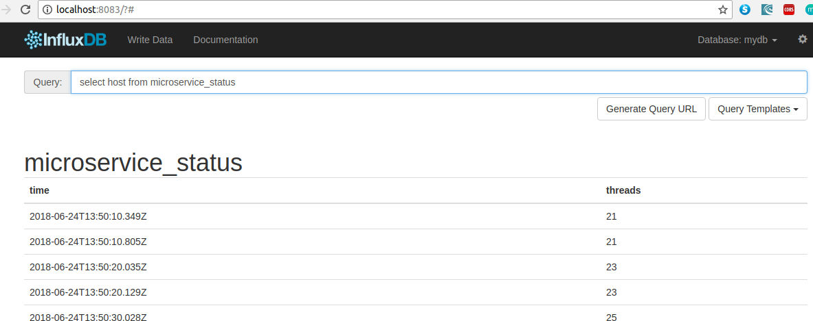
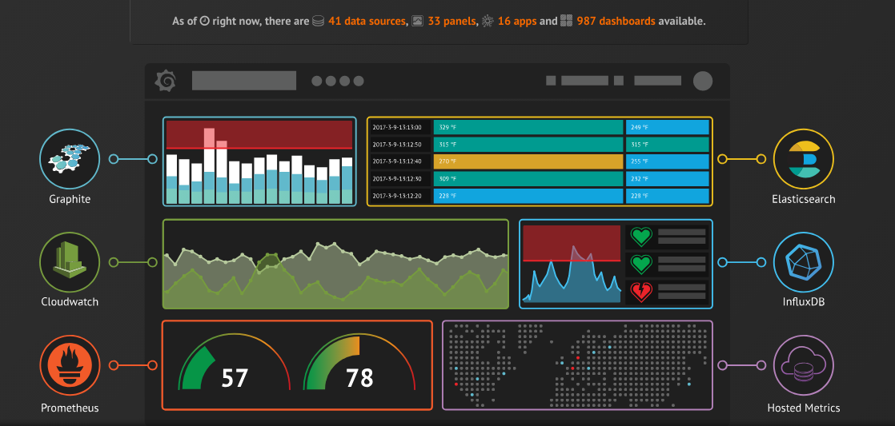
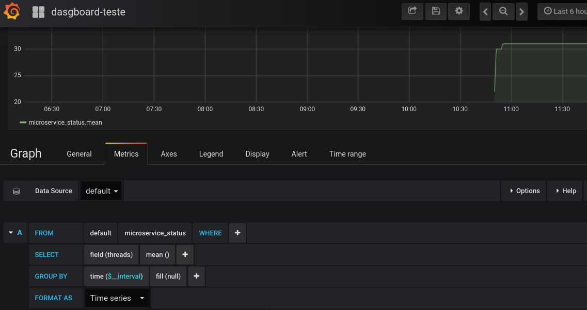
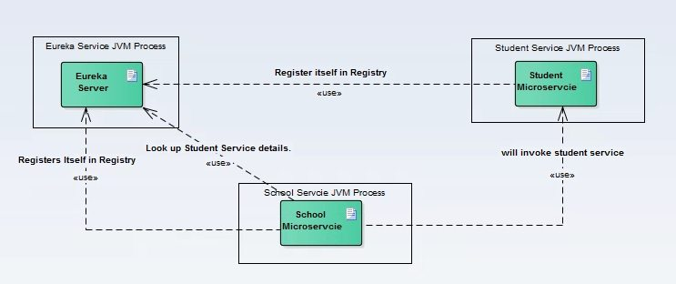
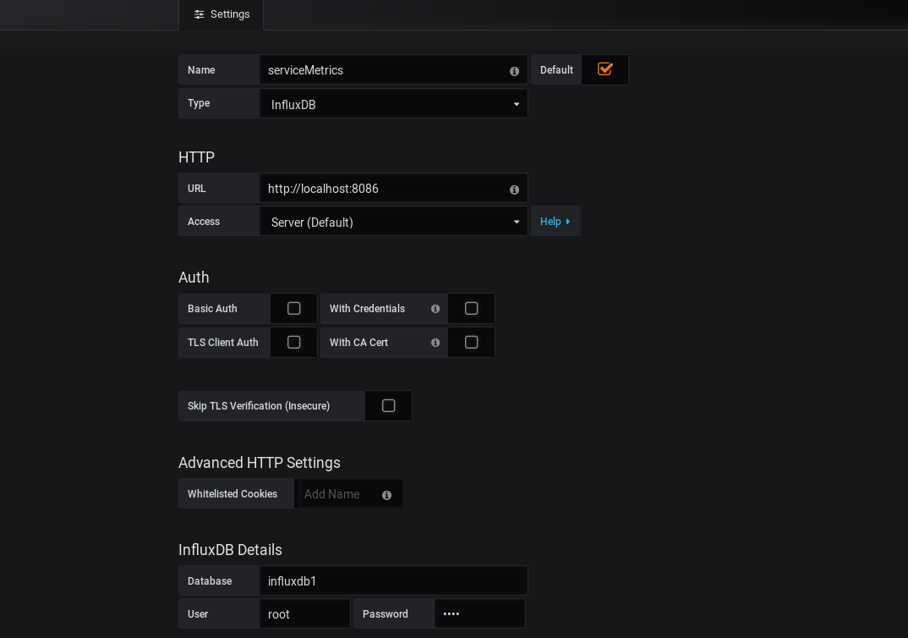
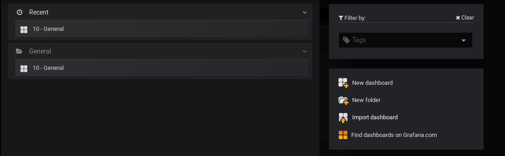
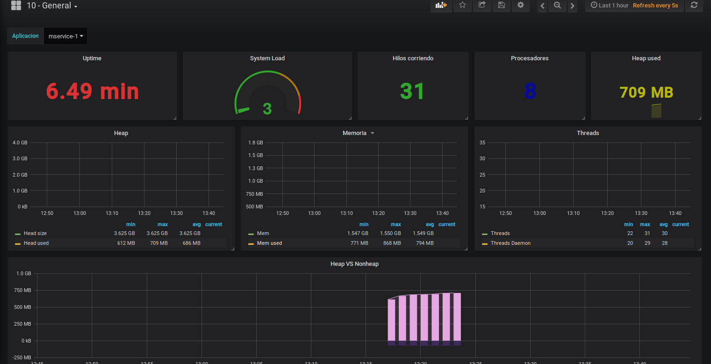

# Prática


----


# Prática - InfluxDb

O InfluxDb é um tipo especial de banco de dados, chamado de Time Series Db.


----

## Time Series Database (TSDB)


Um TSDB é otimizado para dados com registro de data e hora ou séries temporais. Séries temporais são simplesmente medições ou eventos que são rastreados, monitorados, reduzidos e agregados ao longo do tempo.

----

## TSDB - Quando usar?

 São utilizados para armazenar métricas de servidor, monitoramento de desempenho de aplicativos, dados de rede, dados de sensores, eventos, cliques, negociações em um mercado e muitos outros tipos de dados de análise.


----


## TSDB - Qual o diferencial?


A principal diferença de um TSDB com os DB tradicionais é que tudo terá como base a relação cronológica.


----

## TSDB - Como instalar ?

A forma mais simples de criar uma instância de um influxDb é utilizando Docker.

```
docker network create influxdb

docker run -d -p 8083:8083 -p 8086:8086 --net=influxdb -v $PWD/influxdb:/var/lib/influxdb -e INFLUXDB_ADMIN_ENABLED=true -e INFLUXDB_ADMIN_USER=root influxdb:1.0


```

----


## InfluxDb - Rest API

O InfluxDB possui uma api rest que permite executar todos os comandos através do curl.


```

## Ping

curl -sl -I localhost:8086/ping

## Escrita de dados

curl -i -XPOST 'http://localhost:8086/write?db=mydb' --data-binary 'cpu_load_short,host=server01,region=us-west value=0.64 1434055562000000000'

## Buscas

curl -i -XPOST 'http://localhost:8086/query?q=select+host+from+microservice_status&db=mydb'

curl -i -XPOST 'http://localhost:8086/query?q=select+threads+from+microservice_status&db=influxdb1'

```

----

## Influxdb - Web API





----

## Visualização dos Dados


----

## Visualização dos Dados

A web api do influxDb permite uma visualização muito básica dos dados. Então, precisamos de alguma ferramenta de exibição de Time Series, para este exemplo utilizaremos a ferramenta [Grafana](https://grafana.com/).

```
$ wget https://s3-us-west-2.amazonaws.com/grafana-releases/release/grafana-5.1.4.linux-x64.tar.gz

$ tar -zxvf grafana-5.1.4.linux-x64.tar.gz

$ ./grafana-5.1.4.linux-x64/grafana-5.1.4/bin/grafana-server


```

----

## Grafana - O que é?

Grafana é uma ferramenta Open Source para visualização de métricas, ela permite gerar gráficos e índices a partir de Time Series.


----

## Grafana - Como funciona ?





----


## Grafana - Como funciona ?




----

## Prática - checklist


----

## Gerar Dados


Vamos utilizar métricas de aplicações Java.

----


## Gerar Dados - Cenário

Vamos utilizar uma série de microserviços gerando dados, para isto, vamos utilizar
a api [Netflix Eureka](https://github.com/Netflix/eureka) para realizar o service discovery.


----

## Eureka Service Discovery




Fonte: [HowToDoInJava](https://howtodoinjava.com/spring/spring-cloud/spring-cloud-service-discovery-netflix-eureka/)


----

## Projeto de Teste


Para executar os projetos a seguir é necessário a instalação do [Apache Maven](https://maven.apache.org/download.cgi)

```
$ mvn clean install -f service-discovery
$ mvn clean install -f service-metrics-influx
$ mvn clean install -f mservice-1
$ mvn clean install -f mservice-2
$ mvn clean install -f mservice-3

```

----

## Criando Dasource Grafana



----

## Importando o Dashboard

Importar arquivo grafana/dashboard.json no grafana



Créditos: [ypvillazon](https://github.com/ypvillazon)

----

## Demo Dashboard


